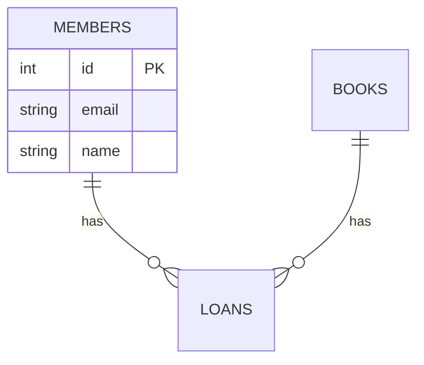

# I1 — ER Diagram from Repo (45 min)

**Goal:** Build an ER diagram for all tables/entities using only the repo as source.

## Required output

1. List of tables and entities with primary keys
2. Foreign keys or inferred relationships
3. **Source file path for each claim**
4. Valid Mermaid ER diagram

## Starter Mermaid template

Cite `app/models.py` for every entity and relationship.
