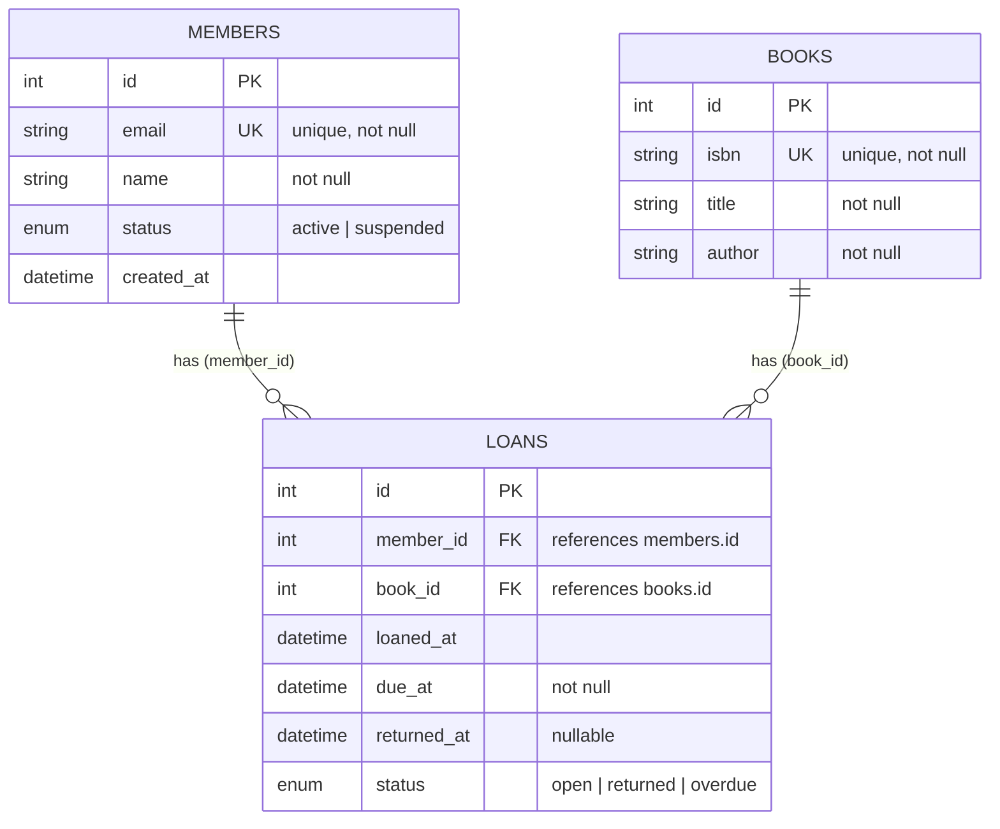

# I1 — ER Diagram from Repo

Complete ER diagram derived from `sample-repo/app/models.py` (SQLAlchemy ORM).

**Source file:** `app/models.py`  
**Database:** SQLite (`sqlite:///./library.db` — see `app/config.py`)

---

## 1. Tables and entities

| Table | ORM entity | Primary key | Source |
|-------|------------|-------------|--------|
| `members` | `Member` | `id` (Integer) | `app/models.py` lines 25–34 |
| `books` | `Book` | `id` (Integer) | `app/models.py` lines 37–45 |
| `loans` | `Loan` | `id` (Integer) | `app/models.py` lines 48–60 |

---

## 2. Columns by entity

### `members` / `Member`

| Column | Type | Constraints | Source |
|--------|------|-------------|--------|
| `id` | Integer | PK | `app/models.py:28` |
| `email` | String(255) | UNIQUE, NOT NULL | `app/models.py:29` |
| `name` | String(120) | NOT NULL | `app/models.py:30` |
| `status` | Enum(`MemberStatus`) | Default `ACTIVE` | `app/models.py:14–16, 31` |
| `created_at` | DateTime | Default `utcnow` | `app/models.py:32` |

**Enum `MemberStatus`:** `active`, `suspended` — `app/models.py:14–16`

### `books` / `Book`

| Column | Type | Constraints | Source |
|--------|------|-------------|--------|
| `id` | Integer | PK | `app/models.py:40` |
| `isbn` | String(20) | UNIQUE, NOT NULL | `app/models.py:41` |
| `title` | String(255) | NOT NULL | `app/models.py:42` |
| `author` | String(120) | NOT NULL | `app/models.py:43` |

### `loans` / `Loan`

| Column | Type | Constraints | Source |
|--------|------|-------------|--------|
| `id` | Integer | PK | `app/models.py:51` |
| `member_id` | Integer | FK → `members.id`, NOT NULL | `app/models.py:52` |
| `book_id` | Integer | FK → `books.id`, NOT NULL | `app/models.py:53` |
| `loaned_at` | DateTime | Default `utcnow` | `app/models.py:54` |
| `due_at` | DateTime | NOT NULL | `app/models.py:55` |
| `returned_at` | DateTime | Nullable | `app/models.py:56` |
| `status` | Enum(`LoanStatus`) | Default `OPEN` | `app/models.py:19–22, 57` |

**Enum `LoanStatus`:** `open`, `returned`, `overdue` — `app/models.py:19–22`

---

## 3. Relationships

| From | To | Cardinality | FK column | ORM relationship | Source |
|------|----|-------------|-----------|------------------|--------|
| `Member` | `Loan` | One-to-many | `loans.member_id` → `members.id` | `Member.loans` ↔ `Loan.member` | `app/models.py:34, 52, 59` |
| `Book` | `Loan` | One-to-many | `loans.book_id` → `books.id` | `Book.loans` ↔ `Loan.book` | `app/models.py:45, 53, 60` |

A member can have many loans. A book can appear in many loans. Each loan belongs to exactly one member and one book.

---

## 4. Mermaid ER diagram



---

## 5. Relationship diagram (ASCII)

```
┌─────────────┐         ┌─────────────┐         ┌─────────────┐
│   MEMBERS   │         │    LOANS    │         │    BOOKS    │
├─────────────┤         ├─────────────┤         ├─────────────┤
│ id (PK)     │◄────────│ member_id   │         │ id (PK)     │
│ email (UK)  │    1:N  │ book_id     │────────►│ isbn (UK)   │
│ name        │         │ id (PK)     │    N:1  │ title       │
│ status      │         │ loaned_at   │         │ author      │
│ created_at  │         │ due_at      │         └─────────────┘
└─────────────┘         │ returned_at │
                        │ status      │
                        └─────────────┘
```

---

## 6. Source summary

All entities, columns, keys, and relationships are defined in:

- **Primary:** `app/models.py`
- **DB URL config:** `app/config.py` (`DATABASE_URL`)
- **Table creation:** `init_db()` in `app/models.py:67–68` via `Base.metadata.create_all()`

No separate migration files exist; schema is inferred entirely from the ORM models.
